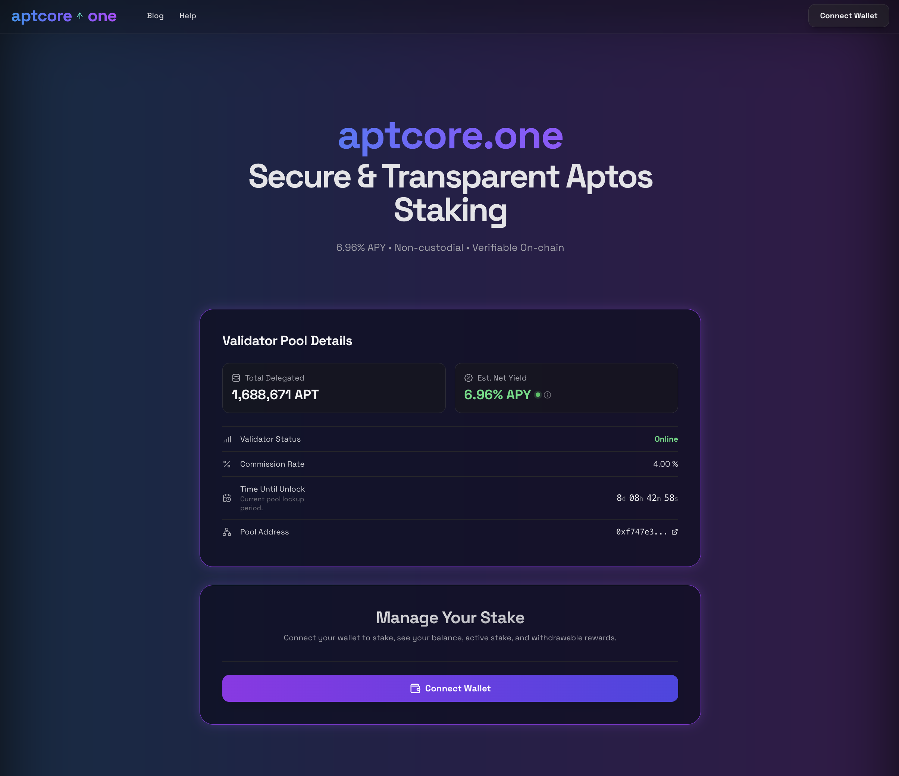

## ⚠️ OFFICIAL LINKS & SECURITY WARNING ⚠️

**This is the ONLY official repository for the aptcore.one project.**

To ensure your safety and protect your assets, please only use our official links:

* **Official Website:** [https://aptcore.one](https://aptcore.one)
* **Official Blog:** [https://aptcore.one/blog](https://aptcore.one/blog)
* **Official X (Twitter):** [https://x.com/aptcoreone](https://x.com/aptcoreone)
* **Official YouTube:** [https://www.youtube.com/@aptcoreone](https://www.youtube.com/@aptcoreone)

Be aware of forks of this repository. Malicious actors may create copies of our site to trick users and steal funds. We are not responsible for any losses incurred from using unofficial, fraudulent versions of our application. **Always double-check the URL.**

---

[](https://aptcore.one/)
[](LICENSE)

Welcome to the **aptcore.one Staking Interface**, a user-friendly web application for staking $APT tokens on the Aptos blockchain. This platform offers a simple, clean, and modern way to delegate your $APT to the official **aptcore.one validator delegation pool** and effectively manage your crypto staking rewards.

**💻 Live Application: [Stake your $APT with aptcore.one](https://aptcore.one/)**

*This application serves as the official staking interface for the [aptcore.one validator](https://aptcore.one/), providing a dedicated and optimized Aptos staking experience for its delegators. The underlying source code (from the `petra-staking-app` repository) is publicly available for transparency and for community members who may wish to adapt it for other Aptos validators.*

Built with cutting-edge web technologies: React, Vite, Tailwind CSS, `@aptos-labs/ts-sdk`, and `@aptos-labs/wallet-adapter-react`.

---

## 📸 Preview


---

## ✨ Key Features of the aptcore.one Staking Platform

* **Seamless Aptos Wallet Connection:** Easily connect a wide array of popular Aptos wallets, including Petra, Martian, Pontem, Rise, Fewcha, MSafe, Nightly, and others, powered by `@aptos-labs/wallet-adapter-react` for automatic detection.
* **Detailed Validator Pool Insights:** Access crucial information about the `aptcore.one` validator pool (or your self-configured Aptos validator). The interface typically displays:
    * Total $APT delegated to the pool (often referred to as TVL - Total Value Locked).
    * The validator's operator commission percentage.
    * Estimated Gross Staking APR (Annual Percentage Rate) and Net Staking APR (after commission). These are generally calculated from on-chain Aptos data.
    * The current pool lockup period end date and the time remaining until unlock.
* **Comprehensive Personal Stake Management:** Get a clear overview of your staking activities directly within the interface:
    * **Active Stake:** Your $APT principal currently staked and actively earning rewards.
    * **Pending Inactive Stake:** $APT that is in the process of being unstaked (unlocking period).
    * **Inactive Stake:** $APT tokens that have completed the unstaking period and are available for withdrawal to your wallet.
* **Essential Staking Operations:** Perform all necessary actions for managing your Aptos stake:
    * **Stake $APT:** Delegate your Aptos tokens to the validator's pool. (The Aptos network has a minimum staking requirement, currently 11 $APT).
    * **Unstake $APT:** Initiate the process to unlock your staked $APT. Rewards typically continue to accrue during the unstaking lockup period.
    * **Withdraw $APT:** Retrieve your unlocked (inactive) $APT back to your connected wallet once the lockup period is complete.
* **Real-time Data Synchronization:** The application is designed to automatically refresh data after successful transactions, ensuring you are viewing the most current status of your stake and pool information.
* **Modern & Responsive User Interface:** Experience a clean, intuitive, dark-themed interface, optimized for ease of use across desktop and mobile devices.

---

## 🛠️ Additional Staking Utilities on aptcore.one

Beyond the core staking interface, `aptcore.one` also provides helpful tools to assist you with your Aptos staking strategy:

* **[Aptos Staking APY Calculator](https://aptcore.one/tools/aptos-staking-apy-calculator)**:
    * Estimate your potential staking rewards and Annual Percentage Yield (APY) based on various inputs. A great tool for planning your staking participation.
* **[Aptos Staking Lockup Visualizer](https://aptcore.one/tools/aptos-staking-lockup-visualizer)**:
    * Understand the dynamics of Aptos staking lockup periods. Visualize when your staked $APT (including rewards) is scheduled to unlock and become withdrawable.

These utilities are designed to provide further clarity and empower you to make more informed decisions regarding your $APT staking.

---

## 🚀 Getting Started Locally (For Developers or Custom Use)

To run this Aptos staking application on your local machine (e.g., for contributing to development or to configure it for a different Aptos validator):

### Prerequisites

* [Node.js](https://nodejs.org/) (LTS version is recommended for compatibility)
* [npm](https://www.npmjs.com/) (comes with Node.js) or [yarn](https://yarnpkg.com/) package manager

### Installation & Local Setup

1.  **Clone the Repository:**
    ```bash
    git clone [https://github.com/p1xel32/petra-staking-app.git](https://github.com/p1xel32/petra-staking-app.git)
    cd petra-staking-app
    ```

2.  **Install Project Dependencies:**
    ```bash
    npm install
    # Alternatively, if you use yarn:
    # yarn install
    ```

3.  **Run the Development Server:**
    ```bash
    npm run dev
    # Alternatively, if you use yarn:
    # yarn dev
    ```
    The application should now be accessible locally, typically at `http://localhost:5173` (Vite will indicate the port).

---

## 🔧 Configuration: Using with a Different Aptos Validator

The live deployment at [aptcore.one](https://aptcore.one/) is specifically pre-configured for the `aptcore.one` validator pool. If you have cloned this repository and intend to use this interface with a *different* Aptos validator's delegation pool, please follow these modification steps:

1.  **Identify the Target Validator's Pool Address:** You will need the unique `owner` address (often referred to as the pool address or staking pool address) of your chosen Aptos validator. This address can usually be found on Aptos blockchain explorers (e.g., AptoScan, Aptos Explorer) or through the validator's official communication channels.
2.  **Update Configuration Constants:** Modify the `VALIDATOR_POOL_ADDRESS` constant within the specified source files. Replace the existing address with the new validator pool address:
    * `src/components/ValidatorInfo.jsx`
    * `src/components/StakeUnstakeControls.jsx`

    ```javascript
    // Example: Modify this line in both indicated files
    const VALIDATOR_POOL_ADDRESS = '0xNEW_VALIDATOR_POOL_ADDRESS_HERE'; // Replace with the actual address
    ```
3.  **Restart Development Server or Rebuild Application:**
    * If your local development server is active, stop it (Ctrl+C) and restart it (`npm run dev` or `yarn dev`).
    * For production deployments (if you are self-hosting), you must rebuild the application (`npm run build` or `yarn build`) and then redeploy the updated build.

---

## ⚠️ Important Disclaimer: Risks of Staking Crypto

Engaging in staking of digital assets, including $APT tokens on the Aptos network, carries inherent risks. These risks include, but are not limited to: potential vulnerabilities within smart contracts (though core Aptos staking contracts are audited by the Aptos Foundation), impermanent loss (if applicable to the asset, though less so for direct staking), and the mandatory lock-up period associated with staking, during which your funds are not immediately liquid or accessible after initiating an unstake request.

This application provides an interface to interact directly with the Aptos blockchain. **You are solely responsible for your actions, decisions, and the security of your private keys and funds.** Always conduct thorough due diligence and your own research (DYOR) before participating in any staking activities or blockchain interactions. The creators and maintainers of this application are not fiduciaries and shall not be liable for any losses, damages, or adverse outcomes you may experience.

---

## 📜 License

This project and its source code are made available under the [MIT License](LICENSE).

---

**Keywords:** *Aptos, Aptos Network, Aptos Blockchain, Staking, APT Staking, Delegate APT, Aptos Staking UI, Aptos Staking Tool, aptcore.one, aptcore.one Validator, Petra Wallet Staking, Martian Wallet Staking, Pontem Wallet Staking, Rise Wallet Staking, Fewcha Wallet Staking, MSafe Wallet Staking, Nightly Wallet Staking, Aptos Wallet Adapter, Aptos Delegation Pool, Aptos Validator Staking, Crypto Staking, Web3 Interface, React Staking App, Vite, Tailwind CSS, $APT, Aptos Staking Interface, Manage Aptos Stake, Aptos Staking Rewards, Secure Staking, APY Calculator, Lockup Visualizer.*
